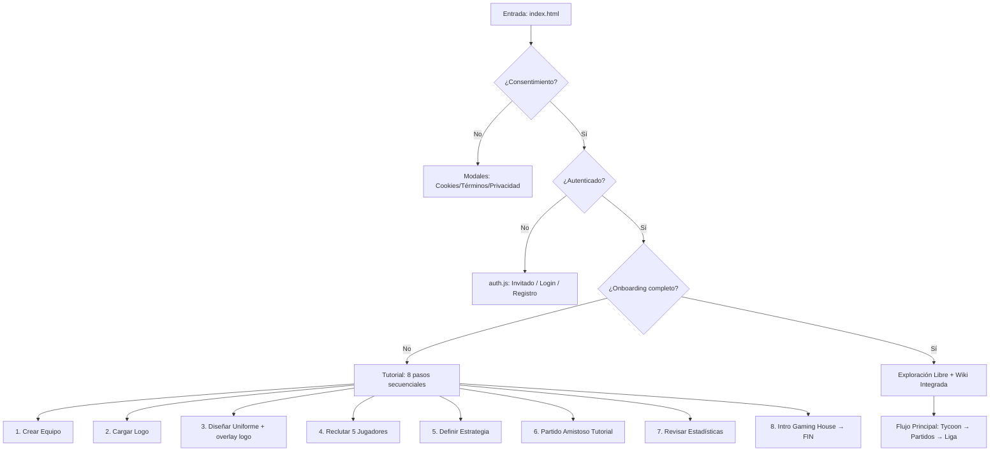

# 🎮 MOBA Manager

> **Simulador de Gestión de Equipos MOBA**  
> **100% Offline · Vanilla JS · AGPL-3.0**  
> **Engine:** Mizu Fractal Engine v2.3.0 "Illustrator Pastel"  
> **Autor:** Moises Núñez · **Studio:** [Mizu Legends Studios](https://mizulegendsstudio.pages.dev)

[](https://www.gnu.org/licenses/agpl-3.0)
[](#-estado-actual)
[](#-stack-técnico)
[](#-filosofía-v10)

---

## ✨ Visión del Proyecto

**MOBA Manager** es un simulador donde asumes el rol de **Director Técnico**:

| Acción | Descripción |
|--------|-------------|
| 👥 Reclutar | Busca talentos, negocia contratos, construye tu roster ideal |
| ♟️ Diseñar | Define tácticas, composiciones de draft y estrategias de juego |
| 💰 Gestionar | Administra presupuesto, sponsors, instalaciones y moral del equipo |
| ⚔️ Competir | Simula partidos, analiza stats y escala en la liga dinámica |

### 🔑 Filosofía v1.0

```
🔒 Offline-first  → Sin cuentas, sin servidores, sin telemetría
🌳 Fractal arch   → Cada página es autónoma, aislada y autocontenida  
🚀 Progresivo     → MVP jugable → expansión estratégica → online (v2.0)
🔍 Transparente   → Código abierto AGPL-3.0, sin cajas negras
```

> 🌳 *"Cada partida es una historia. Cada decisión, un legado."*

---

## 🛠️ Stack Técnico

| Capa | Tecnología | Justificación |
|------|-----------|---------------|
| **Core** | Vanilla JS ES6 Modules | Cero dependencias, máximo control, bundle mínimo |
| **UI** | HTML5 + CSS3 Variables + Scoped Injection | Temas dinámicos, diseño consistente, sin frameworks |
| **Estado** | `stateStore` (reactivo) + `localStorage` | Persistencia local, reactividad sin librerías externas |
| **Eventos** | `eventBus` (pub/sub nativo) | Comunicación desacoplada entre módulos atómicos |
| **Navegación** | Hash-based + Fractal Tree | Deep linking, breadcrumbs dinámicos, sin recargas |
| **Build** | Ninguno (vanilla) | Desarrollo rápido, deployment estático inmediato |
| **Licencia** | GNU AGPL-3.0 | Software libre, colaboración comunitaria garantizada |

**Requisitos mínimos**: Navegador moderno con soporte para ES6 Modules, localStorage y CSS Variables.

---

## 🧠 Arquitectura Fractal v2.3.0

### Principios Fundamentales

1. **1 Archivo = 1 Unidad Atómica**: Cada `.js` en `/pages/` es autónomo, con su propio CSS scoped y ciclo de vida.
2. **Contrato PageModule Estricto**:
   ```javascript
   export default {
     id: 'pagina-id',                    // kebab-case, único
     label: 'Página',                    // Para breadcrumbs
     icon: '🎮',                         // Para UI
     level: 'category|module|page',
     parent: 'padre-id',                 // Para navegación jerárquica
     children: [],                       // Hijos navegables
     css: `[data-page="id"] {...}`,     // CSS scoped obligatorio
     async onMount(container, context) { ... }, // Inicialización
     async onUnmount() { ... }           // Cleanup estricto
   }
   ```
3. **Contexto Seguro**: Las páginas solo acceden a `context.{stateStore, eventBus, navigateTo, dataLoader}`. **NUNCA** `window.mizu` ni globals.
4. **CSS Scoping**: Todas las reglas deben usar prefijo `[data-page="id"]`. Variables de tema: `--bg-dark`, `--text-light`, `--hex-gold`, etc.
5. **Cleanup Obligatorio**: `onUnmount()` debe remover listeners, timers y nullificar refs. Cero memory leaks.

### 🔄 Flujo de Carga de Página

```mermaid
graph LR
    A[Hash Change] --> B[shell.js: loadPage]
    B --> C{Nodo en fractal-tree?}
    C -->|Sí| D[Inyectar nav.hud-nav + #stage]
    C -->|No| E[Redirect a home]
    D --> F{Nodo terminal?}
    F -->|Sí| G[import() módulo + cssInjector + onMount]
    F -->|No| H[Renderizar node-cards navegables]
    G --> I[emit page:loaded]
    H --> I
```

---

## 📁 Estructura del Proyecto

```
/moba-manager
│
├── 📄 index.html                 # Shell mínimo: carga engine + placeholders
├── 🎨 style.css                  # Variables globales + utilidades del engine
│
├── 🧠 /core
│   ├── fractal-tree.js          # Árbol de navegación jerárquica (MAESTRO)
│   ├── shell.js                 # Motor central: routing, lifecycle, contexto
│   ├── state-store.js           # Estado reactivo con suscripciones por path
│   ├── event-bus.js             # Pub/Sub nativo para comunicación desacoplada
│   ├── css-injector.js          # Inyección/remoción de estilos scoped
│   └── save-load.js             # Persistencia localStorage (offline-first)
│
├── 📄 /pages
│   ├── auth.js                  # Login/Registro/Invitado (punto de entrada)
│   │
│   ├── 🎓 /onboarding           # Tutorial guiado (8 pasos)
│   │   ├── tutorial-team.js     # Paso 1: Nombre + País del equipo
│   │   ├── tutorial-logo.js     # Paso 2: Carga de logo (overlay posterior)
│   │   ├── tutorial-uniform.js  # Paso 3: Colores + preview con logo
│   │   ├── tutorial-recruit.js  # Paso 4: Reclutar 5 jugadores iniciales
│   │   ├── tutorial-strategy.js # Paso 5: Definir estrategia base
│   │   ├── tutorial-scrim.js    # Paso 6: Partido amistoso tutorial
│   │   ├── tutorial-stats.js    # Paso 7: Revisar estadísticas
│   │   └── tutorial-gh.js       # Paso 8: Intro al Gaming House → FIN
│   │
│   ├── 👥 /equipos              # Gestión de rosters por categoría
│   │   ├── roster-elite.js      # Plantilla principal (18-40)
│   │   ├── roster-juvenil.js    # Cantera (-18)
│   │   └── roster-leyendas.js   # Veteranos (+33)
│   │
│   ├── 💼 /gestion              # Administración financiera
│   │   ├── finanzas.js          # Presupuesto, ingresos, gastos
│   │   ├── mercado.js           # Fichajes y negociaciones
│   │   └── agentes.js           # Relaciones con representantes
│   │
│   ├── 🧠 /desarrollo           # Scouting y progreso
│   │   ├── entrenamiento.js     # Planes de mejora de atributos
│   │   ├── scouting.js          # Búsqueda y evaluación de prospectos
│   │   └── analisis-talentos.js # Métricas de potencial
│   │
│   ├── 🏠 /tycoon               # Gaming House & Narrativa (Fase 5)
│   │   ├── gaming-house.js      # Hub visual 2D de instalaciones
│   │   ├── construir-gh.js      # Catálogo y colocación de edificios
│   │   ├── academia-talentos.js # Gestión de prospectos y promociones
│   │   ├── sala-prensa.js       # Declaraciones, moral y reputación
│   │   ├── misiones-narrativas.js # Decisiones ramificadas con consecuencias
│   │   ├── rivalidades.js       # Historial y tensión con oponentes
│   │   └── selecciones.js       # Convocatorias nacionales
│   │
│   ├── ⚔️ /partidos             # Motor de simulación (Fase 6)
│   │   ├── draft-picks.js       # Fase Pick/Ban con validación
│   │   ├── partido-en-vivo.js   # Simulación UI en tiempo real
│   │   ├── estadisticas-live.js # Overlay de stats con throttle
│   │   ├── post-partido.js      # Resultados, MVP y recompensas
│   │   └── analisis-rendimiento.js # Métricas profundas post-match
│   │
│   └── 🏆 /liga                 # Competición y reportes (Fase 6)
│       ├── liga-calendario.js   # Standings, fixtures y playoffs CSS puro
│       └── reportes-entrenador.js # Síntesis semanal y ajustes tácticos
│
├── 🗄️ /data
│   ├── match-config.json        # Pesos de simulación, heroes, objetivos
│   ├── tycoon-config.json       # Edificios, narrativa, selecciones
│   └── heroes.json              # Base de héroes mock (MVP)
│
├── 📚 /docs
│   ├── PHASE_1_PLAN.md          # Contrato original Fase 1
│   ├── HANDOFF_FASE5.md         # Protocolo de handoff Fase 5
│   └── STATUS.md                # Estado actual del proyecto (auto-generado)
│
└── 📄 README.md                 # Este archivo
```

---

## 🗺️ Roadmap de Fases

| Fase | Estado | Archivos | Objetivo |
|------|--------|----------|----------|
| **1: Núcleo Jugable** | ✅ Completado | 10 | Loop MVP: Home → Draft → Match → Historial |
| **2: Gestión Básica** | ✅ Integrado | +8 | Rosters, jugadores, staff, persistencia |
| **3: Profundidad Estratégica** | ✅ Integrado | +10 | Finanzas, branding, calendario, estadísticas |
| **4: Online & Comunidad** | ⏸️ Pausado | +7 | PvP async, rankings, sync cloud (v2.0) |
| **5: Tycoon & Narrativa** | ✅ Completado | +8 | Gaming House, misiones, rivalidades, selecciones |
| **6: Motor de Partidos & Liga** | ✅ Completado | +8 | Draft, simulación en vivo, standings, reportes |
| **7: Mercado & Contratos** | 🔄 Propuesto | +8 | Fichajes, salarios, agente, economía profunda |

**Total v1.0**: 48 páginas + 6 core modules + 3 configs = **57 archivos**.

---

## 🔄 Flujo de Onboarding (v1.0)



### Características clave del onboarding:
- ✅ **Offline total**: Sin validación de servidor, todo en localStorage.
- ✅ **Progresivo**: Cada paso guarda automáticamente, permite retroceder.
- ✅ **Accesible**: Navegación por teclado, ARIA labels, contraste WCAG AA.
- ✅ **Skip opcional**: Usuario puede saltar tutorial y aprender explorando.

---

## 📡 Sistema de Estado y Eventos

### `stateStore` — Estado Reactivo Centralizado

```javascript
// Lectura
const moral = context.stateStore.get('team.moral'); // number 0-100

// Escritura (con merge opcional)
context.stateStore.set('team.budget.gold', 5000);
context.stateStore.set('user.onboarding', { step: 3, completed: false }, { merge: true });

// Suscripción (por path)
const unsub = context.stateStore.subscribe('team.moral', (newVal, oldVal) => {
  console.log(`Moral cambió: ${oldVal} → ${newVal}`);
});
// unsub() para limpiar
```

#### Paths principales:
```javascript
user: {
  auth: { status: 'guest'|'registered', nickname, email },
  consent: { cookies, terms, privacy },
  onboarding: { step, completed, skipped },
  preferences: { language, tutorialMode }
}
team: {
  elite: { name, country, logo:{dataUri,isPlaceholder}, uniform:{primary,secondary,accent}, players:[], strategy:{} },
  moral: 75, reputation: 50, budget: { gold: 10000 },
  buildings: [], academy: {}, missions: [], rivalries: {}, nationalCallups: []
}
match: { active:{}, draft:{}, stats:{}, tactics:{} }
league: { standings:[], schedule:[] }
```

### `eventBus` — Comunicación Desacoplada

```javascript
// Emitir evento
context.eventBus.emit('onboarding:step-complete', { step: 3, payload: { ... } });

// Suscribirse (con cleanup)
const unsub = context.eventBus.on('match:finished', handleMatchEnd);
// unsub() para limpiar
```

#### Eventos clave del sistema:
| Evento | Payload | Propósito |
|--------|---------|-----------|
| `onboarding:step-complete` | `{ step, payload }` | Tracking de progreso tutorial |
| `auth:guest-mode` | `{ guestId }` | Entrada como invitado |
| `tutorial:navigated` | `{ from, to }` | Debug de flujo UX |
| `match:finished` | `{ result, stats, players[] }` | Resultado de partido |
| `league:standings-updated` | `{ table: [] }` | Tabla de posiciones actualizada |

---

## 🧭 Navegación Fractal

### `fractal-tree.js` — Mapa Jerárquico Maestro

Cada nodo define:
```javascript
{
  id: 'tutorial-uniform',      // ID único kebab-case
  label: 'Diseñar Uniforme',   // Texto visible
  icon: '👕',                  // Emoji para UI
  level: 'onboarding',         // Jerarquía semántica
  parent: 'tutorial-logo',     // Para breadcrumbs
  children: [],                // Hijos navegables (vacío si terminal)
  terminal: true,              // ¿Carga módulo de página?
  desc: 'Define colores...'    // Tooltip/ayuda
}
```

### Breadcrumbs Dinámicos

El navbar (`<nav class="hud-nav">`) se genera automáticamente desde `historyStack`:

```
🏠 Inicio > 🎓 Onboarding > 🎨 Logo > 👕 Uniforme
```

- Click en cualquier crumb → retrocede a ese nivel.
- Último crumb = página activa (no clicable).
- Auto-scroll horizontal si hay muchos niveles.

### Navegación por Teclado

| Tecla | Acción |
|-------|--------|
| `←` / `Esc` | Retroceder un nivel (breadcrumb anterior) |
| `→` | Entrar al hijo seleccionado (en nodos intermedios) |
| `↑` / `↓` | Mover foco entre elementos interactivos |
| `Enter` / `Space` | Confirmar selección |
| `Tab` | Navegación estándar accesible |

---

## 🛠️ Convenciones de Desarrollo

### Estructura de Página (`pages/*.js`)

```javascript
/*
 * Mizu OS - Nombre Página (pages/id.js)
 * Copyright (C) 2026 Moises Núñez / Mizu Legends Studios
 * License: AGPL-3.0-or-later
 */

/** @type {import('../core/shell.js').PageModule} */
export default {
  id: 'id-pagina',
  label: 'Nombre Visible',
  icon: '🎯',
  level: 'categoria',
  parent: 'padre-id',
  children: [],
  css: `
    [data-page="id-pagina"] {
      /* TODAS las reglas con este prefijo */
      min-height: calc(100vh - 56px);
      padding-top: 56px; /* Espacio para navbar fijo */
    }
  `,
  _state: { listeners: [], containerRef: null, /* refs para cleanup */ },
  
  async onMount(container, context) {
    // 1. Leer estado existente si aplica
    // 2. Inyectar HTML en container.querySelector('#stage')
    // 3. Bind de eventos DOM (guardar en _state.listeners)
    // 4. Suscribirse a eventBus si aplica (guardar unsub)
    // 5. Emitir page:ready (opcional)
  },
  
  async onUnmount() {
    // 1. Remover listeners DOM: _state.listeners.forEach(...)
    // 2. Unsubscribe eventBus: unsub()
    // 3. Limpiar timers: clearInterval/Timeout
    // 4. Nullificar refs: this._state.containerRef = null
  }
};
```

### 🔑 Reglas de Oro

1. ✅ **Nunca** importar páginas entre sí. Comunicación solo vía `eventBus`.
2. ✅ **Nunca** usar `window.mizu` dentro de páginas. Solo `context.xxx`.
3. ✅ **Siempre** scoped CSS con `[data-page="id"]`.
4. ✅ **Siempre** cleanup en `onUnmount()`.
5. ✅ **Siempre** header AGPL-3.0 + JSDoc `@type import`.
6. ✅ **Offline-first**: Sin `fetch` a APIs externas en v1.0.
7. ✅ **Kebab-case** para eventos y IDs: `'match:finished'`, no `'matchFinished'`.

---

## 🧪 Testing y Validación

### ✅ Checklist por Página (7 puntos)

```markdown
- [ ] Header AGPL-3.0 completo + JSDoc @type import
- [ ] Export default con contrato PageModule completo
- [ ] CSS: 100% reglas con [data-page="id"] (Ctrl+F para verificar)
- [ ] onMount usa context.xxx, NO window.mizu ni globals
- [ ] onUnmount limpia listeners, timers, refs (cero memory leaks)
- [ ] Eventos en kebab-case exacto, payloads alineados al spec
- [ ] Navegación: botones usan context.navigateTo, no enlaces directos
```

### 🧪 Pruebas E2E Críticas (v1.0)

| Prueba | Criterio de Éxito |
|--------|------------------|
| **Carga inicial** | Console limpia (0 errors, 0 warnings) |
| **Flujo onboarding** | auth → 8 pasos tutorial → home sin recargas |
| **Navegación fractal** | Breadcrumbs clickeables, teclado funcional |
| **Persistencia offline** | Recargar página → estado se recupera de localStorage |
| **Cleanup sin leaks** | Heap estable tras 10 navegaciones (DevTools Memory) |
| **Temas dinámicos** | Cambiar tema → colores aplican sin romper UI |
| **Responsive** | Mobile/desktop sin scroll horizontal no deseado |

### 🛠️ Herramientas Recomendadas

- **DevTools Console**: Filtrar por `[Shell]`, `[EventBus]` para debug.
- **DevTools Memory**: Heap snapshots tras navegación para detectar leaks.
- **Lighthouse**: Audit de performance, accesibilidad, PWA (offline).
- **JSONLint**: Validar archivos en `/data/` antes de commit.

---

## 🚀 Desarrollo y Contribución

### Primeros Pasos

```bash
# 1. Clonar repositorio
git clone https://github.com/mizulegends/moba-manager.git
cd moba-manager

# 2. Abrir en navegador (sin servidor)
open index.html

# 3. Opcional: live reload para desarrollo
npx serve .  # o python3 -m http.server 8080
```

### Añadir una Nueva Página

1. Definir nodo en `core/fractal-tree.js` (id, label, parent, terminal).
2. Crear `pages/nueva-pagina.js` con contrato PageModule.
3. Registrar en `shell.js` si es terminal: `pageRegistry['nueva-pagina'] = () => import(...)`.
4. Validar con checklist de 7 puntos.
5. Probar navegación: hash directo `#/ruta/a/nueva-pagina`.

### Reportar Bugs / Solicitar Features

- Usar GitHub Issues con etiqueta: `bug`, `enhancement`, `docs`.
- Incluir: pasos para reproducir, console logs, versión del engine.
- Para contribuciones: fork → branch → PR con descripción clara.

---

## 📜 Licencia y Atribución

```
MOBA Manager — Simulador de Gestión de Equipos MOBA
Copyright (C) 2026 Moises Núñez / Mizu Legends Studios

This program is free software: you can redistribute it and/or modify
it under the terms of the GNU Affero General Public License as published
by the Free Software Foundation, either version 3 of the License, or
(at your option) any later version.

This program is distributed in the hope that it will be useful,
but WITHOUT ANY WARRANTY; without even the implied warranty of
MERCHANTABILITY or FITNESS FOR A PARTICULAR PURPOSE. See the
GNU Affero General Public License for more details.

You should have received a copy of the GNU Affero General Public License
along with this program. If not, see <https://www.gnu.org/licenses/>.
```

| Rol | Nombre |
|-----|--------|
| **Autor Principal** | Moises Núñez |
| **Studio** | [Mizu Legends Studios](https://mizulegendsstudio.pages.dev) |
| **Engine** | Mizu Fractal Engine v2.3.0 "Illustrator Pastel" |
| **Contacto** | @mizulegends (GitHub / Redes) |

---

## 🔄 Estado Actual del Proyecto

### ✅ v1.0 CERRADA — Lista para Testers

```markdown
- [x] Core estable: shell.js + fractal-tree.js + routing sin errores
- [x] Navbar fijo + breadcrumbs dinámicos + navegación teclado
- [x] Auth offline: Invitado / Login local con persistencia
- [x] Onboarding completo: 8 pasos secuenciales con guardado automático
- [x] Flujo Tycoon: Gaming House, narrativa, rivalidades, selecciones
- [x] Motor de Partidos: Draft, simulación en vivo, stats, post-match
- [x] Liga: Calendario, standings, playoffs CSS puro, reportes
- [x] Console limpia: 0 errors, 0 warnings, 0 memory leaks en flujo crítico
- [x] Temas: esports/neon/retro/oceanic/sunset aplican globalmente
- [x] Responsive: Mobile/desktop sin scroll horizontal no deseado
```

### 🧪 Próximo: Beta Pública

```markdown
- [ ] Pruebas con 2 testers cerrados (feedback UI/UX)
- [ ] Ajustes menores post-feedback
- [ ] Documentación wiki integrada (/ayuda)
- [ ] Preparar build estático para hosting (GitHub Pages / Netlify)
- [ ] Lanzar beta pública con formulario de reporte de bugs
```

### 🚀 Visión v2.0 (Futuro)

```markdown
- [ ] Modo online: Ligas regionales, PvP async, sync cloud
- [ ] Auth social: Google, Discord, email verification
- [ ] Cloud saves: Sincronización multi-dispositivo
- [ ] Eventos comunitarios: Torneos, rankings globales, espectáculos
```

---

> 🌳 **MOBA Manager v1.0** está listo para ser jugado, probado y compartido.  
> Construido con aislamiento fractal, pasión por la gestión estratégica y compromiso con el software libre.  
> 
> *"Cada partida es una historia. Cada decisión, un legado."*  
> 
> **— Moises Núñez · Mizu Legends Studios · 2026** 🎮⚡🏆

